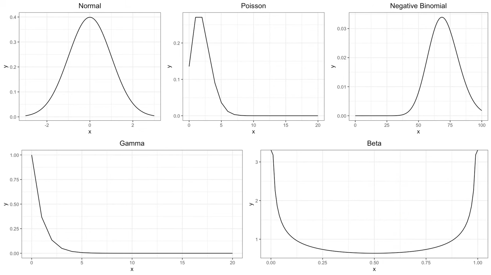

# Distribution tables

A distribution is a representation of the possible values a variable can take and how frequently these occur. While there are more distributions under each category, these are the most recurring in the topics involving statistical computing.

[Introduction to Probability Distributions](https://www.youtube.com/watch?v=CfZa1daLjwo\&list=PLaFfQroTgZnzbfK-Rie19FdV6diehETQy\&ab\_channel=365DataScience)

[Types of Distributions](https://www.youtube.com/watch?v=b9a27XN\_6tg)

<figure><figcaption>
Common distributions
</figcaption></figure>

